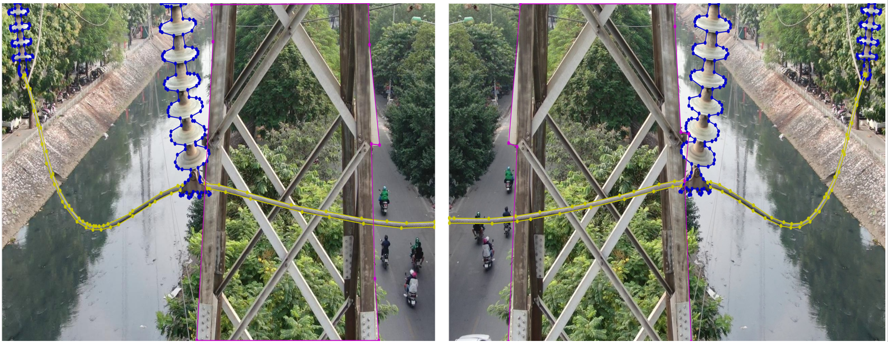

# Data_Augmentation_Label
**Xây dựng tool Data_Augmentation_Label nhằm mục đích với tập ảnh đã được gán nhãn theo kiểu polygon khi dùng các kỹ thuật tăng cường ảnh như lật ngang, zoom ảnh... , biến đổi ảnh khác với ban đầu 
thì ta cũng sinh ra được file gán nhãn phù hợp với ảnh sinh ra đã được biến đổi.**

**Ví dụ**
- **1. Zoom ảnh**

- **2. Lật ngang ảnh**

